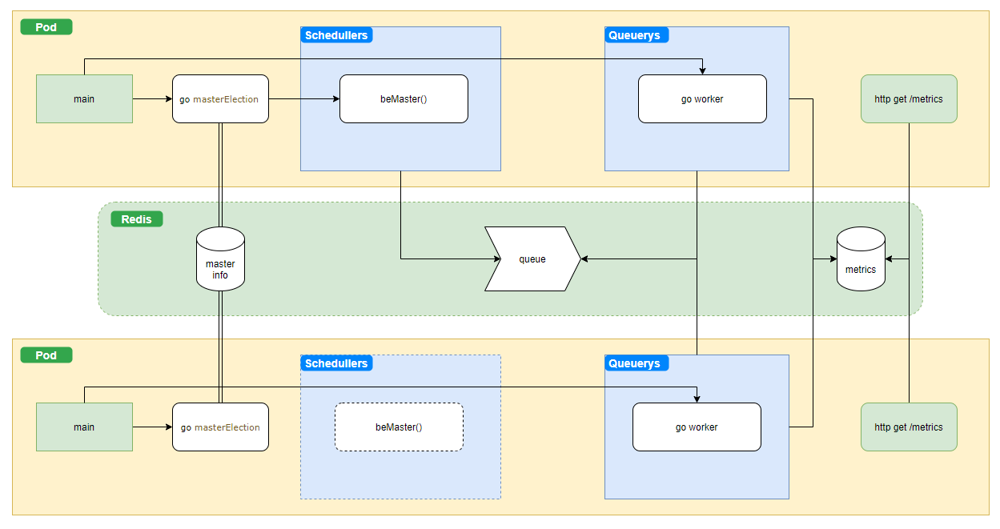

# MFL (metrics-from-logs) 
Получении метрик в формате Prometheus на основании информации из elasticsearch.

Фишки:
* Позволяет горизонтальное масштабирование.
* Требуется наличие Redis



## Конфигурация программы

Основная конфигурация программы производится при помощи переменных среды окружения:

* **MFL_CONF_DIR** - директория, в которой программа будет искать файлы с расширением *.conf. Значение по умолчанию: /etc/mfl/conf.d/
* **MFL_LOG_LEVEL**  - уровень важности сообщений системы логирования. Значение по умолчанию: info.
* **MFL_BIND_ADDR** - адрес и порт, на которых слушает запросы программа. Значение по умолчанию: 0.0.0.0:8080
* **MFL_CONTEXT** - контекст в URL. Значение по умолчанию: /.
* **MFL_ES_HOST** - машина, где запущен elasticsearch. Подставляется как label метрики. Значение по умолчанию: http://127.0.0.1
* **MFL_ES_PORT** - es port. Значение по умолчанию: 9200.
* **MFL_ES_USER** - пользователь с правами которого обращаются к elasticsearch. Значение по умолчанию: "".
* **MFL_ES_PASSWORD** - пароль пользователя. Значение по умолчанию: "".
* **MFL_K8S_POD** - под k8s. Подставляется в строке лога приложения. Значение по умолчанию: "".
* **MFL_K8S_NAMESPACE** - namespace k8s. Подставляется в строке лога приложения. Значение по умолчанию: "".
* **MFL_REDIS_SERVER** - сервер Redis. Значение по умолчанию: 127.0.0.1.
* **MFL_REDIS_PORT** - порт сервера Redis. Значение по умолчанию: - 6379.
* **MFL_REDIS_PASSWORD** - пароль доступа к Redis. Если не определён ("") - доступ без пароля.

Если приложение запускается не в kubernetes, переменные MFL_K8S_POD и MFL_K8S_NAMESPACE определять не надо.

Если нет желания определять переменные среды окружения их значения можно поместить в файл .env. Файл должен находиться в рабочей директории приложения.

Пример файла .env:

```
MFL_CONF_DIR=etc\\mfl\\conf.d\\
MFL_LOG_LEVEL=debug
MFL_BIND_ADDR=127.0.0.1:8080
MFL_CONTEXT=/
MFL_ES_HOST=http://127.0.0.1
MFL_ES_PORT=9200
MFL_ES_USER=user
MFL_ES_PASSWORD=password
MFL_REDIS_SERVER=redis_svc
MFL_REDIS_PORT=1234
```

## Конфигурационные файлы сбора метрик

Конфигурационные файлы приложения должны иметь расширение *.conf. Файлы должны располагаться в директории, указанной в переменной
среды окружения MFL_CONF_DIR.

Все параметры файла являются обязательными.

```yaml
---
metric: test_metric_1 # Название метрики. 
metrichelp: "Тестовая метрика 1, счётчик" # Однострочное, краткое описание метрики.
metrictype: counter # Тип метрики. На данный момент поддерживается только тип counter.
# Запрос в формате elasticsearch. В позициях где необходимо указывать время, ограничивающее
# запрос следует использовать шаблоны {{.Gte}} и {{.Lte}}. В этих местах приложение подставит необходимые 
# на момент выполнения значения. Вместо {{.Gte}} - время последнего запроса. Вместо {{.Lte}} - время,
# когда производится посылка запроса к elasticsearch. 
query: |    
    {     
        "query": {
            "bool": {
                "filter": [
                    {
                        "range": {
                            "@timestamp": {
                                "gte": "{{.Gte}}",
                                "lte": "{{.Lte}}",
                                "format": "strict_date_optional_time"
                            }
                        }
                    },
                    {
                        "match_phrase": {
                            "status": 200
                        }
                    }
                ]
            }
        }
    }
index: "/nginx-access-*" # Название индекса или шаблона.
repeat: 5 # Время повторение запроса в секундах.
delay: 4 # Задержка в секундах, перед первым запросом к elasticsearch. Необходимо для того, что бы при включении
# приложения не возникал "штром" запросов.
```

# Сборка

Все, что нужно для сборки уже есть в Dockerfile

    docker build -t bigkaa/mfl:v0.3.2 "."

# Запуск приложения

Для работы приложения необходим запущенный экземпляр Redis.
## Docker

В Windows:

    docker run -it --rm --name mfl --env-file .env -p 8080:8080 -v C:\path-to\metrics-from-logs\etc\mfl\conf.d:/etc/mfl/conf.d bigkaa/mfl:v0.3.2
    curl http://host.docker.internal:8080

## Linux
    docker run -it --rm --name mfl --env-file .env -p 8080:8080 -v etc/mfl/conf.d:/etc/mfl/conf.d bigkaa/mfl:v0.3.2
    curl http://localhost:8080

## Kubernetes

Перед использованием, отредактируйте файлы примера (01-\*.yaml и 02-*.yaml) в части configMap и указания переменных среды окружения приложения.

Для работы программы необходим работающий сервер Redis. Отредактируйте переменные среды окружения MFL_REDIS_*, для
указания с каким Redis сервером будет работать программа.

Если у вас нет Redis, можете воспользоваться файлом 00-redis.yaml, сгенерированным при помощи helm template из bitnami redis helm
chart. Для его работы необходим storageClass managed-nfs-storage, который используется при создании PVC (см. volumeClaimTemplates).
Так же для доступа к этому серверу Redis потребуется пароль: qgh26rvg9it.  

    kubectl create ns mfl
    kubectl -n mfl apply -f k8s/01-configmap.yaml -f k8s/02-example-deployment.yaml
